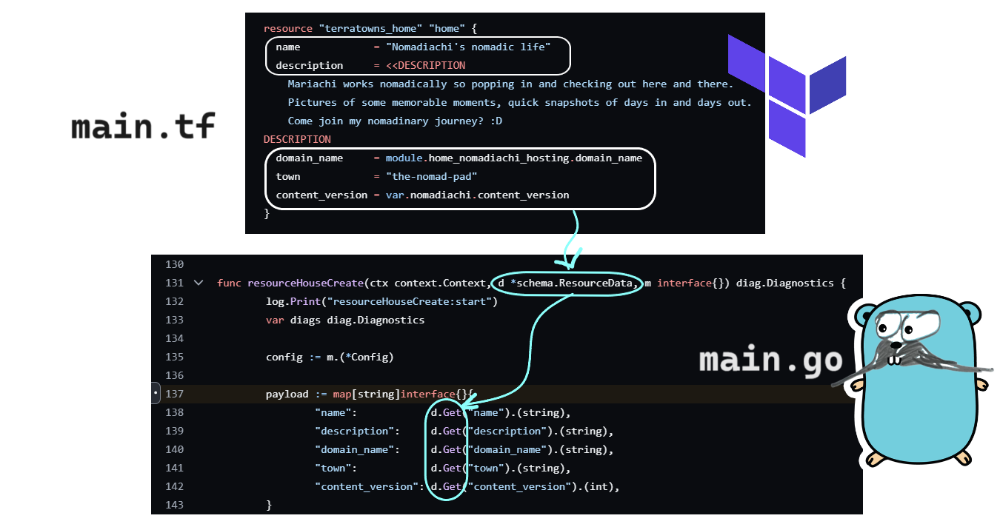

# Crud resourceHouseCreate()


* [The source code: main.go](https://github.com/omenking/terraform-beginner-bootcamp-2023/blob/2.4.0/terraform-provider-terratowns/main.go#L131)


```go
func resourceHouseCreate(ctx context.Context, d *schema.ResourceData, m interface{}) diag.Diagnostics {
	var diags diag.Diagnostics

	config := m.(*Config)

	payload := map[string]interface{}{
		"name": d.Get("name").(string),
		"description": d.Get("description").(string),
		"domain_name": d.Get("domain_name").(string),
		"town": d.Get("town").(string),
		"content_version": d.Get("content_version").(int),
	}
	payloadBytes, err := json.Marshal(payload)
	if err != nil {
		return diag.FromErr(err)
	}

	url :=  config.Endpoint+"/u/"+config.UserUuid+"/homes"
	
	// Construct the HTTP Request
	req, err := http.NewRequest("POST", url, bytes.NewBuffer(payloadBytes))
	if err != nil {
		return diag.FromErr(err)
	}

	// Set Headers
	req.Header.Set("Authorization", "Bearer "+config.Token)
	req.Header.Set("Content-Type", "application/json")
	req.Header.Set("Accept", "application/json")

	// Send HTTP request
	client := http.Client{}
	resp, err := client.Do(req)
	if err != nil {
		return diag.FromErr(err)
	}
	defer resp.Body.Close()

	// parse response JSON
	var responseData map[string]interface{}
	if err := json.NewDecoder(resp.Body).Decode(&responseData);  err != nil {
		return diag.FromErr(err)
	}

	// StatusOK = 200 HTTP Response Code
	if resp.StatusCode != http.StatusOK {
		return diag.FromErr(fmt.Errorf("failed to create home resource, status_code: %d, status: %s, body %s", resp.StatusCode, resp.Status, responseData))
	}

	// handle response status
	homeUUID := responseData["uuid"].(string)
	d.SetId(homeUUID)

	return diags
}
```


* **Function signature**
  * **Line 1**: the argument **`d schema.ResourceData`** object is used to read and set the resource's attributes and manage its state in Terraform.
  * **Line 1**: `diag.Diagnostics` is an object storing diagnostic data from the go package `diag`.
    * "_Package `diag`_ _implements diagnostic functionality, which is a practitioner feedback mechanism for providers. It is designed for display in Terraform user interfaces, rather than logging based feedback, which is generally saved to a file for later inspection and troubleshooting._" ([Terraform official docs](https://pkg.go.dev/github.com/hashicorp/terraform-plugin-framework/diag))
  * `payload`, **lines 6-12:** when a `resource` is declared somewhere in a terraform file (`main.tf` in our bootcamp), the Terraform SDK for custom plugin grabs the attribute data from our `resource` declaration and passes that into the `resourceHouseCreate()` function as an argument. Inside this Create function, the variable `payload` is constructed using the `schema.ResourceData`'s method `Get()` function.&#x20;
    * A **Method** is a function that belongs to a specific object type in Golang.&#x20;

<div data-full-width="true">

<figure><figcaption></figcaption></figure>

</div>

* `payloadBytes, err`, **lines 13-16**: then the payload will be parsed into json format. Any errors captured will be stored in the variable `diag`, which will be returned when the function execution completes.
* **Lines 21-51**: **interacting with TerraTowns API through HTTP**
  * **Lines 22-24**: Construct a HTTP Request
    * A HTTP POST request is created using the `http.NewRequest` function (Remember? `http` is a package we imported in the beginning).
    * The protocol method is POST because we have to push the data of a new house that is created to the [TerraTowns](https://terratowns.cloud/)' database.&#x20;
    * The function `bytes.NewBuffer` creates a new `bytes.Buffer`. Buffer is a bit complicated and deep concept. Just understand that a buffer is a type of data structure that is best for sending data through HTTP request. So we are kind of "parsing" the `payload` data into a buffer so the HTTP POST request can send it over to the destination.
  * **Lines 27-29**: Set headers
    * Headers are some extra information we optionally send along the body of data to the destination API. When we send a letter to someone, we include our address and our name so the recipient knows who they get the letter from.&#x20;
      * `Content-Type`: informs the destination server of the data structure, helping the server to parse the data correctly.&#x20;
      * `Accept`: also informs the destination server of the data structure the sender (our terraform) expects to get in the response.&#x20;
  * **Lines 32-37**:
    * **Line 32**: create an `http` client instance.&#x20;
    * **Line 33**: `client.Do(req)` is a method call on the client instance and sends the HTTP POST request to the specified URL. The URL endpoint is already included in the `req` variable as previously assigned in line 21.&#x20;
    * **Line 34**: if there is an error (if error is not `nil`), the error information will be included in `diag`.&#x20;
    * **Line 37**: `defer` schedules a function call to be executed just before the surrounding function returns. This means that this `defer` statement will only run AFTER the line 52 `d.SetId(homeUUID)` is executed - right before the `resourceHouseCreate` function returns.
  * **Lines 40-42**: Parse response JSON
    * **Line 40**: create a variable `responseData` which is a `map[]` with keys of type string and values of any data type (`interface{}`).
    * **Lines 41-42**: `json.NewDecoder` decodes the response body. If there is any error, it will be stored in `diag`.&#x20;
  * **Lines 46-47**: Check if the HTTP status is OK.
    * **Line 46**: if the HTTP status is not OK,&#x20;
    * **Line 47**: the error information (`resp.StatusCode`, `resp.Status`, `responseData`) will be stored in `diag`.&#x20;
  * **Lines 51-52**: Handle response status
    * **Line 51**: After having dealt with the errors, store the `uuid` (`responseData["uuid"]`) and assert the type (`.(string)`)
    * **Line 52**: Then set the `homeUUID` value to the ID of `d`.
  * **Line 54**: this `resourceHouseCreate()` function interacts with the cloud service's database so it doesn't really return anything about our house. Instead, it returns the `diag` which contains the error information. Remember, **line 37** will run right before **line 54**, as the execution has been put on hold with the `defer` statement.

<figure><figcaption></figcaption></figure>

### Resources

#### Go

* Package [`diag`](https://pkg.go.dev/github.com/hashicorp/terraform-plugin-framework/diag)
* [`Decoder.Decode()`](https://pkg.go.dev/encoding/json#Decoder.Decode)
