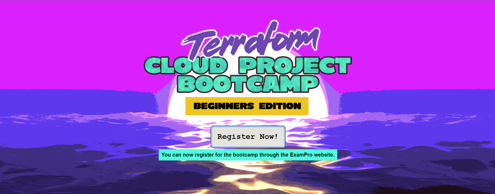

# Welcome

<figure><figcaption>
Image from the official website of <a href="https://terraform.cloudprojectbootcamp.com/">Terraform Cloud Project Bootcamp</a>
</figcaption></figure>

This book is a supplementary reference material for [Andrew Brown](https://www.linkedin.com/in/andrew-wc-brown/) and [Andrew Bayko](https://www.linkedin.com/search/results/all/?fetchDeterministicClustersOnly=true\&heroEntityKey=urn%3Ali%3Afsd\_profile%3AACoAACpgExEBDe45kds7laCsoy-jRoR58KujJp4\&keywords=andrew%20bayko\&origin=RICH\_QUERY\_SUGGESTION\&position=0\&searchId=ecc185ba-8cc3-45f4-929d-a719626ccc1d\&sid=jBQ\&spellCorrectionEnabled=false)'s [Free Terraform Cloud Project Bootcamp](https://terraform.cloudprojectbootcamp.com/). I wrote this myself as part of my Terraform learning and as one extra mile of efforts to understand better what was covered during the course. Please note that this is NOT part of the Andrews' official [Bootcamp](https://terraform.cloudprojectbootcamp.com/) [program](https://docs.google.com/document/d/1Ywh-7qaMz3FHUK6SlpZaXJd\_\_FYQnwIlq8MaRmP\_X\_M/edit), but my personal book.&#x20;

* These [Andrews](https://exampro.co/) based in Schreiber, Ontario, Canada are two incredible super humans who are commited to share cloud knowledge and make cloud learning more accessible to all (~~rumour has it that Bayko is not a super "human" but a super AI~~... shhhh :shushing\_face:).&#x20;

Initially started as a series of [tech blog articles on Medium](https://medium.com/@gwenleigh/terraform-cloud-project-bootcamp-with-andrew-brown-complete-learning-journal-3640cebc74b5), I documented the entire workflow of every video for the Weeks 1 and 2. After having completed the bootcamp, I still felt it was not enough. There still remained may gaps and questions I couldn't answer. As I don't count things as learnt if I can't put them in my own words, I decided to get to the bottom of all things by going through the project line by line.

This short book walks through each tag episode of the bootcamp, attempting to shed light on what is going on between the lines of code. It is written primarily to help myself understand and help fellow beginner terraformers to make sense out of the parts that are invisible, not written anywhere in our code.&#x20;

It would be a great joy for me to know if this guide is ever helpful to at least some of  you. I am a cloud learner myself. I will appreciate any feedback or comments you have. If you spot any mistakes or errors, please feel free to contact me. I would be happy to have a discussion with you.&#x20;

### About the Title - Yes, it's [Chris](https://www.linkedin.com/in/chrisfwilliams/)!

The title comes from [Chris](https://www.linkedin.com/in/chrisfwilliams/)' comment during the Week 2 live stream. We had to switch the mode for terraform state management between the local environment and Terraform Cloud. This got many of us lost and confused (~~and yes, I was one of the first to get knocked out..~~. :boxing\_glove: shhh... :shushing\_face:).&#x20;

Yes, we were camping in the multiverse of madness. Here are the good laughs from the moment. [Go take a listen](https://www.youtube.com/watch?v=pWCejw1Mk50\&ab\_channel=ExamPro), this will make your Terraform journey a lot more enjoyable and fun.

## Disclaimer

The entirety of the Terraform Cloud Project used throughout this book (all code) was developed and offered for free by [Andrew Brown](https://www.linkedin.com/in/andrew-wc-brown/) and [Andrew Bayko](https://www.linkedin.com/search/results/all/?fetchDeterministicClustersOnly=true\&heroEntityKey=urn%3Ali%3Afsd\_profile%3AACoAACpgExEBDe45kds7laCsoy-jRoR58KujJp4\&keywords=andrew%20bayko\&origin=RICH\_QUERY\_SUGGESTION\&position=0\&searchId=ecc185ba-8cc3-45f4-929d-a719626ccc1d\&sid=jBQ\&spellCorrectionEnabled=false). The [Andrews](https://exampro.co/)' original project and the source code can be found [here on their Github repo](https://github.com/omenking/terraform-beginner-bootcamp-2023) and the [video playlist here](https://www.youtube.com/watch?v=eiox8xFsCpE\&list=PLBfufR7vyJJ4q5YCPl4o2XAzGRZUjuD-A\&ab\_channel=ExamPro).

I do not claim the authorship of the learning [curriculum](https://docs.google.com/document/d/1Ywh-7qaMz3FHUK6SlpZaXJd\_\_FYQnwIlq8MaRmP\_X\_M/edit), [code](https://github.com/omenking/terraform-beginner-bootcamp-2023), development methodology, logic or any other intellectual assets and knowledge, and/or derivatives produced by the [Andrews](https://exampro.co/) and/or coming from [their bootcamp](https://terraform.cloudprojectbootcamp.com/), [video series](https://www.youtube.com/watch?v=eiox8xFsCpE\&list=PLBfufR7vyJJ4q5YCPl4o2XAzGRZUjuD-A\&ab\_channel=ExamPro), and their [Github repository](https://github.com/omenking/terraform-beginner-bootcamp-2023).&#x20;

I authored the explanations of the code. I did create all the goofy illustrations used throughout the book. I hope you find the Gopherachi in the Hat a pleasant companion through your Terraform/Go journey.
